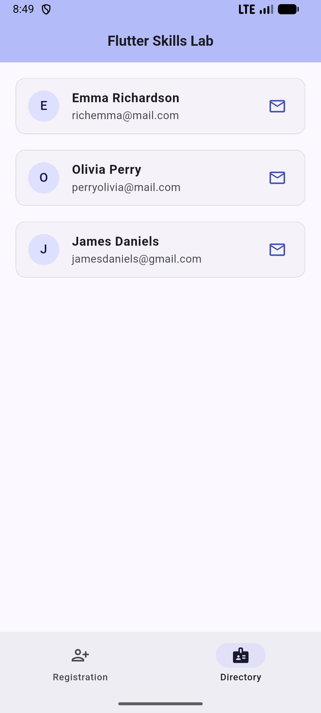

# Flutter Skills Lab 🚀

| Registration Screen | Directory Screen |
|:---:|:---:|
|  |  |

## 🌟 Key Features
- **Form Architecture:** Sophisticated user registration with real-time email validation.
- **Clean Code:** UI logic separated into independent screens (`lib/screens/`) for better maintainability.
- **Material 3:** Modern UI components including `NavigationBar` and elevated `Cards`.
- **State Management:** Dynamic list updates and interactive UI state transitions.

## 🛠️ Skills Demonstrated
- **Folder Structuring:** Professional separation of concerns.
- **Form Handling:** `GlobalKey<FormState>`, `TextEditingController`, and RegEx validation.
- **Resource Management:** Proper use of `dispose()` to prevent memory leaks.
- **UI UX:** Implementation of `AnimatedSwitcher` for smooth screen transitions.
